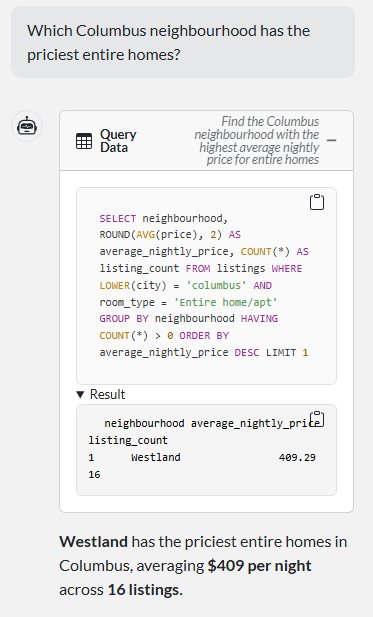
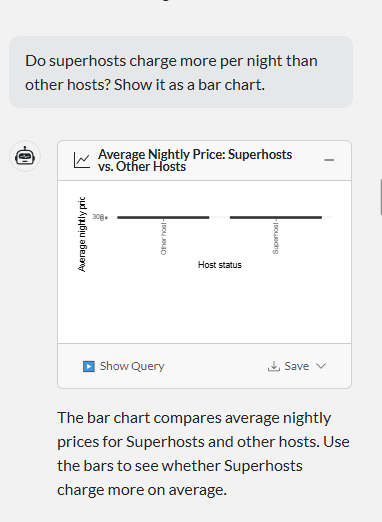
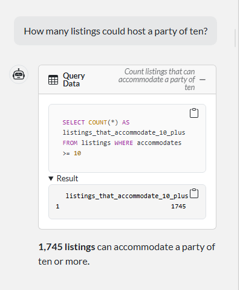

# Midwest Airbnb Explorer

Ask questions about Midwest Airbnb listings in plain English and get SQL, tables, and visualizations back.

## Live App

https://midwest-airbnb-chat-znef.onrender.com/

## What is this app?

This QueryChat app explores 14,887 Airbnb listings from Chicago, Columbus, and the Twin Cities. Users can ask questions about prices, neighborhoods, room types, reviews, availability, hosts, and other listing information.

The app translates questions into SQL and uses the `listings` table in `data/midwest_airbnb.db`.

## Dataset Information

**Source:** Inside Airbnb

**Listings:** 14,887

**Regions and snapshot dates:**

- Chicago — July 20, 2026
- Columbus — July 23, 2026
- Twin Cities — July 21, 2026

The data dictionary is located in `data/data_desc.md`, and additional QueryChat rules are located in `data/extra_instructions.md`.

## Example Questions

### 1. Which Columbus neighborhood has the priciest entire homes?

### 2. Do superhosts charge more per night than other hosts? Show it as a bar chart.

### 3. How many listings could host a party of ten?

